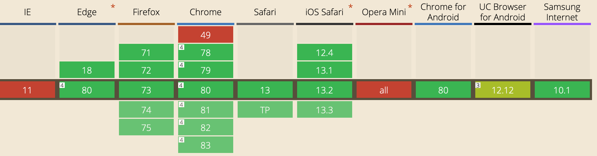

# animate-on-view
A **tiny (1.63 KB)** vanilla JavaScript plugin that animates elements as they come into view.


## How to Install
1. Include the `aov.js` file in your site directory.
2. Link `aov.js` in your web page.
## How to Configure
1. Add class `aov` to whatever element you wish to be animated.
2. Create an animation in your stylesheet, at the very minimum with an opacity keyframe. For example:
```
@keyframes slide-left {
  0% {
    opacity: 0;
    transform: translate3d(-5rem, 0, 0);
  }

  100% {
    opacity: 1;
    transform: translate3d(0, 0, 0);
  }
}
```
3. Add the `data-aov-` data-attribute along with your desired keyframe animation. For example: `data-aov="slide-left"`.
4. Optionally, you can add `aov-duration` and `aov-delay` attributes which take an `integer` Miliseconds are not supported at this time. Integers are used for the purpose of creating interesting animation offsets. For example:
```
<?php
  $i = 0;
  foreach ($animated_elements as $el) {
    echo "<h3 aov-delay='$i' class='aov'>$el->heading</h3>";
  }
  $i = $i+0.25;
?>
```
You'll notice how an iterated integer in a `for` loop can be utilized to create interesting animations.

Codepen Link: https://codepen.io/scramlo/pen/vYOmjOO

## Supported Browsers (As of February 2020)

